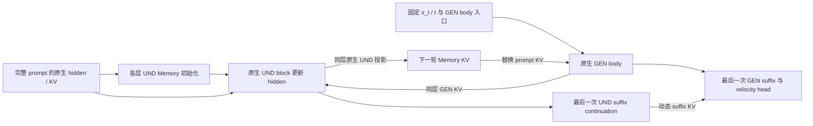

# BAGEL：持续 UND Memory 的 denoiser 内部循环

目标：在冻结 BAGEL 权重、增加有限推理计算的条件下，通过 Memory 反馈修复文生图的数量、属性和空间关系。

`main` 只保留 **持续 UND state＋全量动态 KV 替换**。默认 **R2**。当前比较早／中／晚位置的6个层窗口，另加原生 Base。没有其他生成架构、adapter、gate、压缩或训练模块。

## 架构

UND 是 BAGEL 的理解专家，GEN 是生成专家；KV 是 attention 的键和值。Memory 保留完整 prompt 的 token 数量、顺序和原始位置。

一次 denoiser 调用内，`x_t` 和 `t` 固定。`P_l` 为层 l 的原生 prompt KV；`H_l^r` 为该层第 r 轮的 Memory hidden；`M_l^r` 为它投影得到的 KV。



每个 body 层独立执行：

`H_l^(r+1) = Native UND block_l(H_l^r; P_l, GEN_l^r KV, live self KV)`

`M_l^(r+1) = Native UND KV projection_l(H_l^(r+1), original positions)`

- 第0轮 GEN 读取原生 prompt KV。额外轮读取同层 Memory，Memory 替换 prompt 条件，不与 prompt KV 叠加。
- GEN 每轮恢复相同 body 入口。只有各层 UND hidden 作为轮间状态持续传递。
- 最后一次 writer 从 body 输出继续执行 UND suffix。最后的 GEN suffix 读取动态 Memory，执行一次并输出速度 v。
- R2 表示 **3次 GEN body＋2次 UND writer body**；GEN prefix、GEN suffix 和最终读出各一次，UND suffix continuation 一次。
- 特殊 token 的 hidden/KV 固定为原生值。Memory 不跨采样步、样本或 CFG 分支传递。无 prompt 的 CFG 分支走原生路径。
- 原生 BAGEL 权重和模块保持冻结，支持 packed variable-length 图像输入。新增的是推理数据流，不声称它与原生 attention 拓扑相同。

## 已有证据

下面是清理前目标路径的历史结果，并非本次重新生成。历史窗口为 `[0,8)`。32个 structural prompts、seed0、512px、50个时间点、shift3、CFG4，共297条语义约束。

| 路径 | Semantic GM | 质量代理分 | Repair / Damage vs Base |
|---|---:|---:|---:|
| Base | 0.0925 | 0.7422 | — |
| 持续 UND Memory R2 | 0.1361 | 0.7266 | 20 / 24 |

人工抽查确认了局部数量编辑。左侧为 Base，右侧为 R2。

**#06：要求三只黄兔、两朵紫蘑菇、三只棕猴。两只兔／两只猴变为三只兔／三只猴。**


**#24：要求四辆白色自行车在三头塑料牛前。六头牛变为三头牛；自行车数量和牛的属性仍需单独检查。**


证据范围：冻结模型可产生具体语义 Repair；还没有证明平均净收益。R2 的 GM 增量95%区间为 `[-0.01730, +0.12027]`，跨零；约71%的 GM 净增量来自 #06。代理 Repair/Damage 为20/24。R3 会丢失部分修复并增加损伤，不作为默认深度。质量分为 VLM 代理，不能替代人工质量判断。原生 UND 对 noisy GEN 的语义理解能力尚未建立。

现阶段研究问题：**保留已出现的数量／属性修复，同时减少物体丢失和关系损伤。** 本仓库只提供 training-free 推理与验证；没有启动训练。

原始图片的 source、noise 和 image hashes 见 [证据来源](assets/evidence.json)。完整历史代码、文档、日志和结果已移至工作区 `older/und-memory-main-before-cleanup-20261007_121406/`；不混入当前展示目录。

## 六个层窗口

真实 BAGEL checkpoint 有28层。层索引从0开始；窗口右端不包含。六组均为R2、8层 body，Memory 更新与动态 suffix 语义保持一致。

| 组名 | body 窗口 | UND writer suffix 层数 |
|---|---|---:|
| early_1 | [0,8) | 20 |
| early_2 | [4,12) | 16 |
| middle_1 | [8,16) | 12 |
| middle_2 | [12,20) | 8 |
| late_1 | [16,24) | 4 |
| late_2 | [20,28) | 0 |

另生成一个共享 Base。32 prompts × seed0 × 7组，共224张图。各组使用同 prompt、同初始噪声、同采样参数；所有去噪步都启用所选窗口。**body 等宽不代表总计算量相同**：writer suffix 长度随窗口变化。报告同时记录实际耗时和显存；耗时仅为未预热的工程日志。

[window_comparison.json](configs/window_comparison.json)由脚本实际读取。该配置同时固定R2、6个窗口、32 prompts、seed0、512px、50个时间点、shift3、CFG4与global CFG renormalization。模型层数不符、窗口越界或数值检查失败时停止。

## 代码结构

```text
configs/window_comparison.json   唯一窗口比较配置
data/prompts32.jsonl            32个评测 prompt
qwen_latent_cot/bagel/
  internal_loop.py               唯一运行时与 Base 旁路
  layerwise_memory.py            完整 prompt capture / packed KV
  und_state_loop.py              持续 UND hidden / 动态 body 与 suffix
  native_und.py                  原生 UND KV 投影
  modeling/                     原生 BAGEL；native_source.json 记录来源
qwen_latent_cot/evaluation/      配对指标、评分与数值检查工具
scripts/compare_windows.py      数值检查、生成、评分、汇总与 HTML 对比
scripts/compare_windows_8gpu.sh  多卡启动；每卡分配独立 prompt
tests/test_numerics.py          必要数值测试
tests/helpers.py               小模型 fixture
tests/oracles/                 清理前选定路径的冻结数值参照
assets/                         两组历史图像证据
```

旧脚本和其他测试已删除；历史完整副本在工作区 `older/und-memory-before-window-compare-20261007_132531/`。冻结参照只用于数值测试，不是可运行的生成支线。

## 在 H200 上运行

正式 GPU 检查、生成和评分均由用户启动。先使用分配给本任务的8张卡，再在远端运行：

```bash
cd /private/yida_workspace/bagel-LatentCoT-main-window-compare-20261007
export GPUS=0,1,2,3,4,5,6,7
export RUN=/private/yida_workspace/outputs/und_windows6_r2_$(date +%Y%m%d_%H%M%S)
set -o pipefail
bash scripts/compare_windows_8gpu.sh "$RUN" 2>&1 | tee "${RUN}.log"
```

需要4卡时，只修改 `GPUS` 的4个卡号。模型 Python、judge、权重与 GenEval2 路径保留远端已有默认值，也可通过环境变量设置。

脚本依次执行：绑定源代码／权重／prompt hashes → 六个窗口真实权重数值检查 → 生成224张图 → 配对语义与质量代理评分 → 汇总和离线 HTML。权重仅在准备阶段完整计算一次hash，后续检查文件大小和修改时间。每个窗口独立执行原生 prompt prefill，避免复用错误层位置的 Memory seed。

进度记录在 `e0.log`、`generation/worker_*.log` 与 `quality/worker_*.log`。结果为 `quality_report/summary.md`、`quality_report/summary.json` 与 `comparison.html`。统计包含 Semantic GM、质量代理、Invalid、Repair/Damage、prompt-cluster置信区间、耗时和显存。Repair/Damage 仍需人工审查。

## 验证范围

只保留必要数值检查：六个窗口R2的 hidden／velocity 与冻结选定 runner 精确一致；原生 hidden→KV 投影、R0旁路、轮间 UND hidden 更新、固定 GEN 入口、完整 prompt、特殊 token、动态 suffix、样本／调用隔离以及 cache／权重不变。

远端隐藏CUDA后，CPU数值测试 **12 passed**。六个窗口都通过冻结路径的精确 parity，包括 `[20,28)` 的空 suffix 边界。另用CPU模拟任务检查了两份 prompt 分片、七组配对、评分合并、窗口排序、HTML导出及缺失配对拒绝。所有Python语法、shell语法和 `git diff --check` 通过。此次 BAGEL 核心架构代码和证据图片未改动。

CPU 检查使用小模型；任务流程检查使用模拟生成和评分，不证明真实权重的语义增益或质量。真实权重检查和正式图像评测由上面的用户命令完成。
