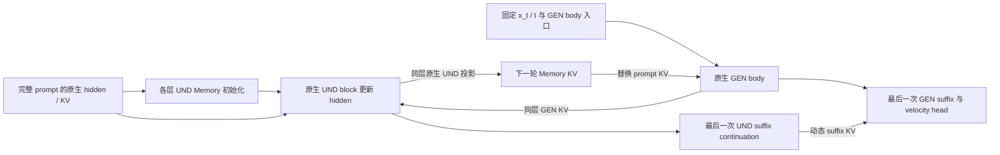

# BAGEL：持续 UND Memory 的 denoiser 内部循环

目标：在冻结 BAGEL 权重、增加有限推理计算的条件下，通过 Memory 反馈修复文生图的数量、属性和空间关系。

`main` 只保留 **持续 UND state＋全量动态 KV 替换**。默认 **R2、body `[0,8)`**。唯一模型对照为原生 Base。R1/R3 仅用于同一架构的深度诊断，没有其他生成架构、adapter、gate、压缩或训练模块。

## 架构

UND 是 BAGEL 的理解专家，GEN 是生成专家；KV 是 attention 的键和值。Memory 保留完整 prompt 的 token 数量、顺序和原始位置。

一次 denoiser 调用内，`x_t` 和 `t` 固定。`P_l` 为层 l 的原生 prompt KV；`H_l^r` 为该层第 r 轮的 Memory hidden；`M_l^r` 为它投影得到的 KV。



每个 body 层独立执行：

`H_l^(r+1) = Native UND block_l(H_l^r; P_l, GEN_l^r KV, live self KV)`

`M_l^(r+1) = Native UND KV projection_l(H_l^(r+1), original positions)`

- 第0轮 GEN 读取原生 prompt KV。额外轮读取同层 Memory，Memory 替换 prompt 条件，不与 prompt KV 叠加。
- GEN 每轮恢复相同 body 入口。只有各层 UND hidden 作为轮间状态持续传递。
- 最后一次 writer 从 body 输出继续执行 UND suffix。最后的 GEN suffix 读取动态 Memory，执行一次并输出速度 v。
- R2 表示 **3次 GEN body＋2次 UND writer body**；GEN prefix、GEN suffix 和最终读出各一次，UND suffix continuation 一次。
- 特殊 token 的 hidden/KV 固定为原生值。Memory 不跨采样步、样本或 CFG 分支传递。无 prompt 的 CFG 分支走原生路径。
- 原生 BAGEL 权重和模块保持冻结，支持 packed variable-length 图像输入。新增的是推理数据流，不声称它与原生 attention 拓扑相同。

## 已有证据

下面是清理前目标路径的历史结果，并非本次重新生成。32个 structural prompts、seed0、512px、50个时间点、shift3、CFG4，共297条语义约束。

| 路径 | Semantic GM | 质量代理分 | Repair / Damage vs Base |
|---|---:|---:|---:|
| Base | 0.0925 | 0.7422 | — |
| 持续 UND Memory R2 | 0.1361 | 0.7266 | 20 / 24 |

人工抽查确认了局部数量编辑。左侧为 Base，右侧为 R2。

**#06：要求三只黄兔、两朵紫蘑菇、三只棕猴。两只兔／两只猴变为三只兔／三只猴。**


**#24：要求四辆白色自行车在三头塑料牛前。六头牛变为三头牛；自行车数量和牛的属性仍需单独检查。**


证据范围：冻结模型可产生具体语义 Repair；还没有证明平均净收益。R2 的 GM 增量95%区间为 `[-0.01730, +0.12027]`，跨零；约71%的 GM 净增量来自 #06。代理 Repair/Damage 为20/24。R3 会丢失部分修复并增加损伤，不作为默认深度。质量分为 VLM 代理，不能替代人工质量判断。原生 UND 对 noisy GEN 的语义理解能力尚未建立。

现阶段研究问题：**保留已出现的数量／属性修复，同时减少物体丢失和关系损伤。** 本仓库只提供 training-free 推理与验证；没有启动训练。

原始图片的 source、noise 和 image hashes 见 [证据来源](assets/evidence.json)。完整历史代码、文档、日志和结果已移至工作区 `older/und-memory-main-before-cleanup-20261007_121406/`；不混入当前展示目录。

## 代码结构

```text
configs/internal_loop.yaml        唯一默认配置：R2 / [0,8)
data/prompts32.jsonl              当前32个评测 prompt
qwen_latent_cot/bagel/
  internal_loop.py                唯一运行时与 Base 旁路
  layerwise_memory.py             完整 prompt capture / packed KV
  und_state_loop.py               持续 UND hidden / 动态 body 与 suffix
  native_und.py                   原生 UND KV 投影
  modeling/                      原生 BAGEL；native_source.json 记录来源
qwen_latent_cot/evaluation/       配对指标与只读张量诊断
scripts/evaluate/                原生检查、生成、评分与 HTML 导出
tests/                          目标路径回归与冻结旧实现的 parity oracle
assets/                         两组已有图像证据
```

## 在 H200 上运行

正式 GPU 检查、生成、评分及预算测量均由用户启动。下面使用新输出目录；每张卡负责独立 prompt，不是模型并行。

```bash
cd /private/yida_workspace/bagel-LatentCoT-main-und-memory-r2-20261007
export GPUS=0,1,2,3,4,5,6,7
export LOOP_DEPTHS=2 START_LAYER=0 END_LAYER=8
export RUN=/private/yida_workspace/outputs/und_memory_r2_$(date +%Y%m%d_%H%M%S)
set -o pipefail
bash scripts/evaluate/run_und_state_8gpu.sh "$RUN" 2>&1 | tee "${RUN}.log"
```

脚本先执行真实权重 E0。检查失败就停止。通过后，默认生成 Base/R2 各32张，再评分并导出 `quality_report/summary.md` 和 `comparison.html`。卡必须是分配给本任务的卡；四卡可将 `GPUS` 改为四个卡号。

可选只读诊断：同一 Base 轨迹的 step0/24/48，比较本架构 R1/R2/R3 的 hidden、实际 Memory KV 和速度，不生成或评分最终图片。

```bash
export RUN=/private/yida_workspace/outputs/und_memory_diag_$(date +%Y%m%d_%H%M%S)
bash scripts/evaluate/run_memory_round_diagnostic_8gpu.sh "$RUN" 2>&1 | tee "${RUN}.log"
```

[默认配置](configs/internal_loop.yaml)是配置说明。实际运行参数由上述脚本和 CLI 提供，不自动读取 YAML。普通生成耗时仅为工程日志；正式预算由 `scripts/evaluate/benchmark_budget.py` 单独测量。

## 清理后的验证

远端隐藏 CUDA 后，CPU 回归 **36 passed / 1 skipped**。跳过项为 CUDA 检查。覆盖清理前目标 runner 与新主路径的 hidden／velocity 精确 parity（R1/R2/R3、窗口起点0/1），完整 prompt 容量、原生投影、动态 suffix、特殊 token、样本／调用隔离、cache／权重不变，以及 Base/R2 生成续跑、固定输入诊断和报告合并。

全部 Python 文件语法检查、shell 入口语法检查和 `git diff --check` 通过。原生 vendor 来源检查通过。正式 GPU 评测没有重跑；以上工程检查不证明语义或质量收益。
