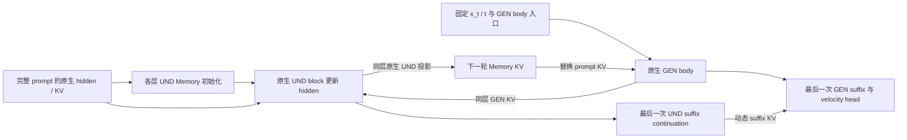

# BAGEL：持续 UND Memory 的 denoiser 内部循环

目标：在冻结 BAGEL 权重、增加有限推理计算的条件下，通过 Memory 反馈修复文生图的数量、属性和空间关系。

`main` 只保留 **持续 UND state＋全量动态 KV 替换**。默认 **R2**。当前固定层窗口 `[0,8)`，比较早期去噪 loop、同样执行20步的晚期 loop，以及全程 loop，另加原生 Base。没有其他生成架构、adapter、gate、压缩或训练模块。

## 架构

UND 是 BAGEL 的理解专家，GEN 是生成专家；KV 是 attention 的键和值。Memory 保留完整 prompt 的 token 数量、顺序和原始位置。

一次 denoiser 调用内，`x_t` 和 `t` 固定。`P_l` 为层 l 的原生 prompt KV；`H_l^r` 为该层第 r 轮的 Memory hidden；`M_l^r` 为它投影得到的 KV。



每个 body 层独立执行：

`H_l^(r+1) = Native UND block_l(H_l^r; P_l, GEN_l^r KV, live self KV)`

`M_l^(r+1) = Native UND KV projection_l(H_l^(r+1), original positions)`

- 第0轮 GEN 读取原生 prompt KV。额外轮读取同层 Memory，Memory 替换 prompt 条件，不与 prompt KV 叠加。
- GEN 每轮恢复相同 body 入口。只有各层 UND hidden 作为轮间状态持续传递。
- 最后一次 writer 从 body 输出继续执行 UND suffix。最后的 GEN suffix 读取动态 Memory，执行一次并输出速度 v。
- R2 表示 **3次 GEN body＋2次 UND writer body**；GEN prefix、GEN suffix 和最终读出各一次，UND suffix continuation 一次。
- 特殊 token 的 hidden/KV 固定为原生值。Memory 不跨采样步、样本或 CFG 分支传递。无 prompt 的 CFG 分支走原生路径。
- 原生 BAGEL 权重和模块保持冻结，支持 packed variable-length 图像输入。新增的是推理数据流，不声称它与原生 attention 拓扑相同。

## 已有证据

下面是清理前目标路径的历史结果，并非本次重新生成。历史窗口为 `[0,8)`。32个 structural prompts、seed0、512px、50个时间点、shift3、CFG4，共297条语义约束。

| 路径 | Semantic GM | 质量代理分 | Repair / Damage vs Base |
|---|---:|---:|---:|
| Base | 0.0925 | 0.7422 | — |
| 持续 UND Memory R2 | 0.1361 | 0.7266 | 20 / 24 |

人工抽查确认了局部数量编辑。左侧为 Base，右侧为 R2。

**#06：要求三只黄兔、两朵紫蘑菇、三只棕猴。两只兔／两只猴变为三只兔／三只猴。**


**#24：要求四辆白色自行车在三头塑料牛前。六头牛变为三头牛；自行车数量和牛的属性仍需单独检查。**


证据范围：冻结模型可产生具体语义 Repair；还没有证明平均净收益。R2 的 GM 增量95%区间为 `[-0.01730, +0.12027]`，跨零；约71%的 GM 净增量来自 #06。代理 Repair/Damage 为20/24。R3 会丢失部分修复并增加损伤，不作为默认深度。质量分为 VLM 代理，不能替代人工质量判断。原生 UND 对 noisy GEN 的语义理解能力尚未建立。

现阶段研究问题：**保留已出现的数量／属性修复，同时减少物体丢失和关系损伤。** 本仓库只提供 training-free 推理与验证；没有启动训练。

原始图片的 source、noise 和 image hashes 见 [证据来源](assets/evidence.json)。完整历史代码、文档、日志和结果已移至工作区 `older/und-memory-main-before-cleanup-20261007_121406/`；不混入当前展示目录。

## 早期去噪时间窗口

六个模型层位置的32-prompt对比已完成。`[0,8)` 的 Semantic GM 最高，因此本轮固定该层窗口和R2。它的Repair/Damage为20/24，尚未证明平均净收益；选择它是为了检验已有局部语义编辑能否在更低开销下保留。

本轮只改变 loop 的时间窗口。每张图仍使用原生49次 denoiser 调用。step从0开始，窗口右端不包含。关闭loop后，当前 `x_t` 继续走原生 BAGEL 路径；不会恢复Base轨迹的 `x_t`。Memory 仍只在当前denoiser调用内持续更新，不跨去噪步传递。

| 组名 | 启用 loop 的step | loop调用数 | 首／末次启用的t |
|---|---|---:|---|
| BASE | 不启用 | 0 | — |
| EARLY_05 | [0,5) | 5 | 1.000 / 0.971 |
| EARLY_10 | [0,10) | 10 | 1.000 / 0.930 |
| EARLY_20 | [0,20) | 20 | 1.000 / 0.826 |
| LATE_20 | [29,49) | 20 | 0.674 / 0.059 |
| FULL | [0,49) | 49 | 1.000 / 0.059 |

`t=1` 为纯噪声，`t=0` 为干净图像。这里使用原生shift3调度；早期按执行顺序定义，实际t同时记录。前20步覆盖高噪声区，最后一次loop更新后进入 `t≈0.813`，随后使用原生路径。Early20／Late20执行同样数量的loop调用，但沿不同噪声状态运行；实测耗时仍需单独比较。

固定32个prompt、seed0、512px、50个时间点、shift3、CFG4和global CFG renormalization，共 **192张图**。各组重新生成Base／Full以形成完整同权重、同prompt、同噪声配对，不复用历史评分。

待验证的假设：早期loop形成数量或布局修复，关闭后由原生路径完成后续生成，可能减少全程loop的额外损伤。早期更有效尚未得到证据。

主要比较：

- Early5／10／20对Base：语义GM、Repair/Damage、质量代理、Invalid与开销。
- Early5／10／20对Full：是否保留Full已有的Repair，并避免Full造成的Damage。
- Early20对Late20：在loop调用数相同的条件下，效果是否与时间位置有关。
- 人工审查全部32个prompt，重点复查#06、#24；不凭单个样本的增益选择结论。

脚本输出上述配对统计与prompt-cluster置信区间。置信区间未经多重比较校正，不能作为多组筛选后的确认性证据。质量和语义评分仍是VLM代理，需人工审查。

## 代码结构

```text
configs/window_comparison.json   唯一比较配置：固定[0,8)、R2，改变时间窗口
data/prompts32.jsonl            32个评测prompt
qwen_latent_cot/bagel/           持续UND state、全量动态body／suffix KV与原生Base
qwen_latent_cot/evaluation/      配对评分、Repair保留／Damage避免、数值检查
scripts/compare_windows.py      准备、数值检查、生成、评分、报告与HTML
scripts/compare_windows_8gpu.sh  唯一多卡启动脚本
tests/test_numerics.py          必要数值测试
tests/helpers.py               小模型fixture
tests/oracles/                 冻结目标runner的数值参照
assets/                         已有历史图像证据
```

配置由脚本实际读取。时间窗通过已有 `progress_start / progress_end` 控制；使用 `step/48` 和含两端的progress区间，精确对应表中的半开step窗口。不会改动BAGEL层、权重或Memory更新公式，也没有新增adapter或训练模块。窗口外直接调用原生decoder。

## 在 H200 上运行

正式GPU数值检查、生成和评分由用户启动。在远端使用分配给本任务的8张卡运行：

```bash
cd /private/yida_workspace/bagel-LatentCoT-main-early-time-compare-20261007
export GPUS=0,1,2,3,4,5,6,7
export RUN=/private/yida_workspace/outputs/und_early_time_r2_$(date +%Y%m%d_%H%M%S)
set -o pipefail
bash scripts/compare_windows_8gpu.sh "$RUN" 2>&1 | tee "${RUN}.log"
```

四卡只需修改 `GPUS`。脚本依次执行：绑定源代码／权重／prompt hashes → 五个loop组的真实权重数值检查 → 生成192张图 → 配对评分 → 报告和离线HTML。数值检查包含窗口外与原生路径的velocity精确一致；检查失败就停止。

进度见 `e0.log`、`generation/worker_*.log` 和 `quality/worker_*.log`。结果见 `quality_report/summary.md`、`quality_report/summary.json` 与 `comparison.html`。配置同时记录各组的准确loop步数、t范围与GEN body总执行次数；耗时仅为未预热的工程日志。

## 验证范围

CPU数值检查使用小模型：固定 `[0,8)` 的Full R2与冻结选定runner精确一致；时间窗内与Full精确一致；时间窗外与原生decoder精确一致；检查首步、末步和切换边界，防止少算或多算一个loop步。此外保留原生hidden→KV投影、完整prompt、UND hidden更新、动态suffix、特殊token、样本／调用隔离与cache／权重不变的检查。

远端隐藏CUDA后，必要数值测试 **11 passed**。CPU模拟流程检查通过：两份prompt分片、六组配对、准确窗口配置、报告合并、Repair保留／Damage避免统计、HTML导出和缺失配对拒绝。Python语法、shell语法与 `git diff --check` 通过。

CPU与模拟任务流程检查不能证明真实权重下的质量或语义收益。正式GPU评测尚未启动。此前六个层窗口的配置、脚本和文档已完整备份到工作区 `older/und-memory-before-early-time-compare-20261007_215020/`，此前远端结果目录保留。
