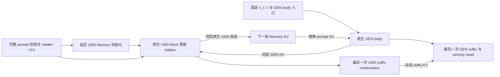
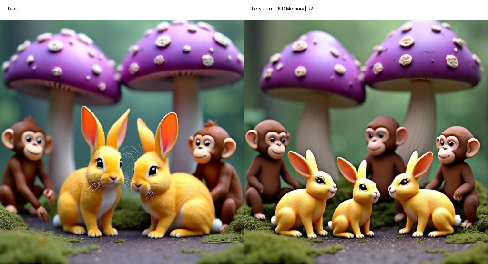
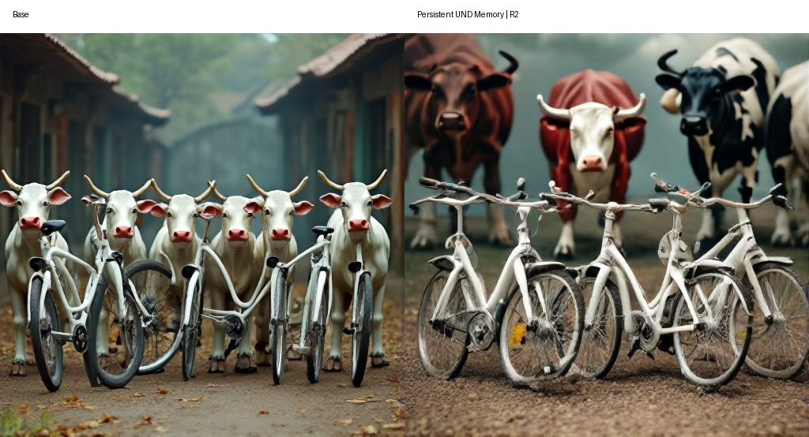

# BAGEL：持续 UND Memory 的 denoiser 内部循环

目标：在冻结 BAGEL 权重、增加有限推理计算的条件下，通过 Memory 反馈修复文生图的数量、属性和空间关系。

`main` 只保留 **持续 UND state＋全量动态 KV 替换**。固定层窗口 `[0,8)`，比较 Early10／Early20 × R1–R4。另提供原生 BAGEL 显式反馈编辑的小规模教师参照。没有 adapter、gate、压缩或训练模块。

## 架构

UND 是 BAGEL 的理解专家，GEN 是生成专家；KV 是 attention 的键和值。Memory 保留完整 prompt 的 token 数量、顺序和原始位置。

一次 denoiser 调用内，`x_t` 和 `t` 固定。`P_l` 为层 l 的原生 prompt KV；`H_l^r` 为该层第 r 轮的 Memory hidden；`M_l^r` 为它投影得到的 KV。



每个 body 层独立执行：

`H_l^(r+1) = Native UND block_l(H_l^r; P_l, GEN_l^r KV, live self KV)`

`M_l^(r+1) = Native UND KV projection_l(H_l^(r+1), original positions)`

- 第0轮 GEN 读取原生 prompt KV。额外轮读取同层 Memory，Memory 替换 prompt 条件，不与 prompt KV 叠加。
- GEN 每轮恢复相同 body 入口。只有各层 UND hidden 作为轮间状态持续传递。
- 最后一次 writer 从 body 输出继续执行 UND suffix。最后的 GEN suffix 读取动态 Memory，执行一次并输出速度 v。
- R2 表示 **3次 GEN body＋2次 UND writer body**；GEN prefix、GEN suffix 和最终读出各一次，UND suffix continuation 一次。
- 特殊 token 的 hidden/KV 固定为原生值。Memory 不跨采样步、样本或 CFG 分支传递。无 prompt 的 CFG 分支走原生路径。
- 原生 BAGEL 权重和模块保持冻结，支持 packed variable-length 图像输入。新增的是推理数据流，不声称它与原生 attention 拓扑相同。

## 已有证据

下面是清理前目标路径的历史结果，并非本次重新生成。历史窗口为 `[0,8)`。32个 structural prompts、seed0、512px、50个时间点、shift3、CFG4，共297条语义约束。

| 路径 | Semantic GM | 质量代理分 | Repair / Damage vs Base |
|---|---:|---:|---:|
| Base | 0.0925 | 0.7422 | — |
| 持续 UND Memory R2 | 0.1361 | 0.7266 | 20 / 24 |

人工抽查确认了局部数量编辑。左侧为 Base，右侧为 R2。

**#06：要求三只黄兔、两朵紫蘑菇、三只棕猴。两只兔／两只猴变为三只兔／三只猴。**



**#24：要求四辆白色自行车在三头塑料牛前。六头牛变为三头牛；自行车数量和牛的属性仍需单独检查。**



证据范围：冻结模型可产生具体语义 Repair；还没有证明平均净收益。R2 的 GM 增量95%区间为 `[-0.01730, +0.12027]`，跨零；约71%的 GM 净增量来自 #06。代理 Repair/Damage 为20/24。此前 R3 会丢失部分修复并增加损伤；本轮扩大样本，重新检验深度效应。质量分为 VLM 代理，不能替代人工质量判断。原生 UND 对 noisy GEN 的语义理解能力尚未建立。

现阶段研究问题：**保留已出现的数量／属性修复，同时减少物体丢失和关系损伤。** 本仓库只提供 training-free 推理与验证；没有启动训练。

原始图片的 source、noise 和 image hashes 见 [证据来源](assets/evidence.json)。完整历史代码、文档、日志和结果已移至工作区 `older/und-memory-main-before-cleanup-20261007_121406/`；不混入当前展示目录。

## 当前判断与实验边界

固定相同初始噪声，loop 仍会改变 velocity，随后轨迹会分叉。这不是字面上的重新采样噪声，但视觉效果可能类似重采样。已有结果只能证明局部语义发生变化，不能证明 Memory 识别了错误并定向修复。

此前32题的早期时间对比：Early10 R2 的 GM 为0.1333、质量代理0.7188、Repair/Damage为19/22；Early20 R2 为0.1329、0.6953、24/30。Base 为0.0925、0.7422。它们不足以证明平均净收益，不能据此启动训练。

### A：固定架构的大规模时间 × 深度比较

完整 GenEval2 **800 prompts × seed0 × 9组 = 7200张图**。共享同一组 Base；其余为 Early10 R1–R4、Early20 R1–R4。同 prompt 各组严格共享初始噪声。先扩大 prompt 覆盖，尚不检验多 seed 稳定性。

- 模型层：`[0,8)`，即第0–7层，右端不包含。
- Early10：49次原生 denoiser 调用中的 step `[0,10)`；Early20：`[0,20)`。
- 原生50个时间点、shift3、512px、CFG4、global renormalization。精确 t 范围写入 plan。
- R 是额外轮数。R4 在启用 loop 的一次调用中执行5次 GEN body、4次 UND writer body。最终 GEN suffix 和读出只执行一次。
- Memory 不跨去噪步。关闭 loop 后沿当前轨迹继续原生生成，不跳回 Base 的轨迹。
- 报告全部800题，并分开报告此前用过的32题与新增768题。数据来自工作区 `refs/GenEval2/geneval2_data.jsonl`，完整保留 prompt、语义问题和技能标签；校验值与许可在 data/。

比较每组相对 Base 的语义 GM、Repair/Damage、质量代理、Invalid、耗时与显存；另外比较同 R 的 Early20 对 Early10，以及各时间窗内相邻 R。提供 prompt-cluster bootstrap 区间，未做多重比较校正。VLM 分数不是人工质量判断。不能只报告最好的一组或少数成功图片。

### B：先验证信息，再考虑蒸馏

prompt KV 是文本编码，不自带对当前生成错误的观察。新增一个昂贵但原生的 training-free 参照：

1. 原生 BAGEL 从 prompt 生成 Base 图像。
2. BAGEL UND 通过原生 ViT 输入观察这张干净图像，生成结构化文字：可见事实、明确差错、应保留内容、不确定项、最小编辑指令。
3. 通过 BAGEL 原生图像编辑接口，把**完整源图像的 VAE＋ViT 上下文、原始请求和完整反馈文字**重新编码成条件 KV。
4. 原生 GEN 完成编辑；不启用隐式 loop，不向 noisy GEN 强行接入另一段位置不匹配的 KV。

全量保留原生上下文；不池化、不筛选 prompt token、不压缩 slot。使用 BAGEL 自带图像预处理。文字反馈使用原生位置重新 prefill，不能直接移植观察阶段的缓存，因为其上下文、位置和模态布局不同。文本达到生成上限或 JSON 格式错误时记录失败，不静默截断，不删除失败配对。

先跑此前32题、seed0，三组共96张图：

| 组 | 输入与作用 |
|---|---|
| BASE | 原生文生图，作为共同源图像 |
| GENERIC_EDIT | 源图像＋原始请求＋通用最小编辑指令 |
| FEEDBACK_EDIT | 同一源图像＋同一请求＋针对该图像的完整文字反馈 |

两种编辑使用相同初始噪声、原生编辑 CFG（text3、image1.5、interval 0.4–1），共享相同源图像。主要因果比较是 FEEDBACK_EDIT 对 GENERIC_EDIT；两者对 Base 的变化不能单独归因于文字反馈。记录反馈原文、token IDs、源图像与噪声 hashes、上下文长度、各阶段耗时。没有保存原始 KV 张量，缓存可由绑定模型与输入重建。评分仍由独立的 Qwen3-VL＋GenEval2 评估器完成。

**是否继续的依据**：人工核验反馈事实正确；具体差错得到修复；正确内容与质量得到保留；相对通用编辑确有增益。JSON 合法、velocity 变化、图片差异或单个成功案例都不能替代这些证据。

这一步是显式教师参照，不是已实现的 denoiser 内部语义反馈。若原生理解或编辑仍失败，先定位反馈事实、指令遵循和保真中的问题，不进入蒸馏。若成功，下一步才研究在固定 x_t/t 下获得可见预测、生成反馈并回到同一 denoiser 状态；目前未实现这个桥接。

Monet 的借鉴限于“图像观察提供可检查的信息，再通过阶段训练迁移到隐式状态”。依据工作区 `refs/Monet/README.md`、`src/task.py`、`src/trainer.py` 与论文方法部分；Monet 本身经过训练，不是冻结 BAGEL 编辑可行的证据。这里没有引入其 latent token、adapter 或损失。后续可先训练 UND 的观察／反馈格式，保持 GEN 冻结；只有有效教师和位置、token 对应关系成立后，才讨论隐式 Memory 蒸馏，不能直接对不同上下文 KV 做逐项回归。当前没有训练代码或训练任务。

BAGEL 接口依据工作区 `refs/Bagel/inferencer.py` 的原生理解、交错上下文与编辑顺序；图像变换取自 `data/transforms.py`，来源 hashes 记录在 `qwen_latent_cot/bagel/modeling/native_source.json`。

## 运行（用户在 H200 上执行）

使用分配给本任务的8张卡。先运行大规模矩阵：

```bash
cd /private/yida_workspace/bagel-LatentCoT-main-depth-feedback-20261008
export GPUS=0,1,2,3,4,5,6,7
export CONFIG="$PWD/configs/window_comparison.json"
export RUN=/private/yida_workspace/outputs/und_depth_grid_$(date +%Y%m%d_%H%M%S)
set -o pipefail
bash scripts/compare_windows_8gpu.sh "$RUN" 2>&1 | tee "${RUN}.log"
```

上一个任务完成后，再运行独立的32题反馈试验：

```bash
export CONFIG="$PWD/configs/feedback_comparison.json"
export RUN=/private/yida_workspace/outputs/und_feedback_native_$(date +%Y%m%d_%H%M%S)
bash scripts/compare_windows_8gpu.sh "$RUN" 2>&1 | tee "${RUN}.log"
```

脚本绑定源代码、配置、权重与数据，然后依次运行真实权重数值检查、生成、评分和报告。数值检查失败则停止。支持 `RESUME=1 bash scripts/compare_windows_8gpu.sh "$RUN"`，必须保留原 RUN、CONFIG、代码、权重和分片数量。不要在同一批卡上同时启动两个任务。

结果为 `quality_report/summary.md`、`summary.json`、`comparison.html` 与 `gallery/`。HTML 每页16个 prompt/seed，下载时同时保留 comparison.html 与 gallery/。反馈原文也嵌入对应图片页面。进度见 e0.log、generation/worker_*.log、quality/worker_*.log。

## 代码与验证范围

仅保留两个比较入口：`scripts/compare_windows.py` 与 `scripts/compare_windows_8gpu.sh`。两个配置分别描述大规模矩阵与反馈试验。必要数值测试仍集中在 tests/，没有旧实验脚本。

19项 CPU 检查通过：R1–R4 与冻结目标路径一致；Early10／Early20 边界正确；窗口外与原生路径一致；原生 hidden→KV 投影、持续 UND state、动态 suffix、特殊 token 和缓存隔离保持正确。另已通过 CPU 模拟流程：17题×9组的分片、断点续跑、10项比较、分页 HTML 和缺失配对拒绝；3题×3组反馈流程的共享源图像／噪声、完整反馈、评分和报告。新增上下文检查覆盖原生图像→文字的顺序及两条 CFG 缓存隔离。真实权重检查与正式评测由用户运行，CPU 测试不证明语义或质量收益。

本次变更前的完整代码、文档及 Git bundle 位于工作区 `older/before-depth-feedback-20261008_001707/`。旧结果和远端旧快照保留。
